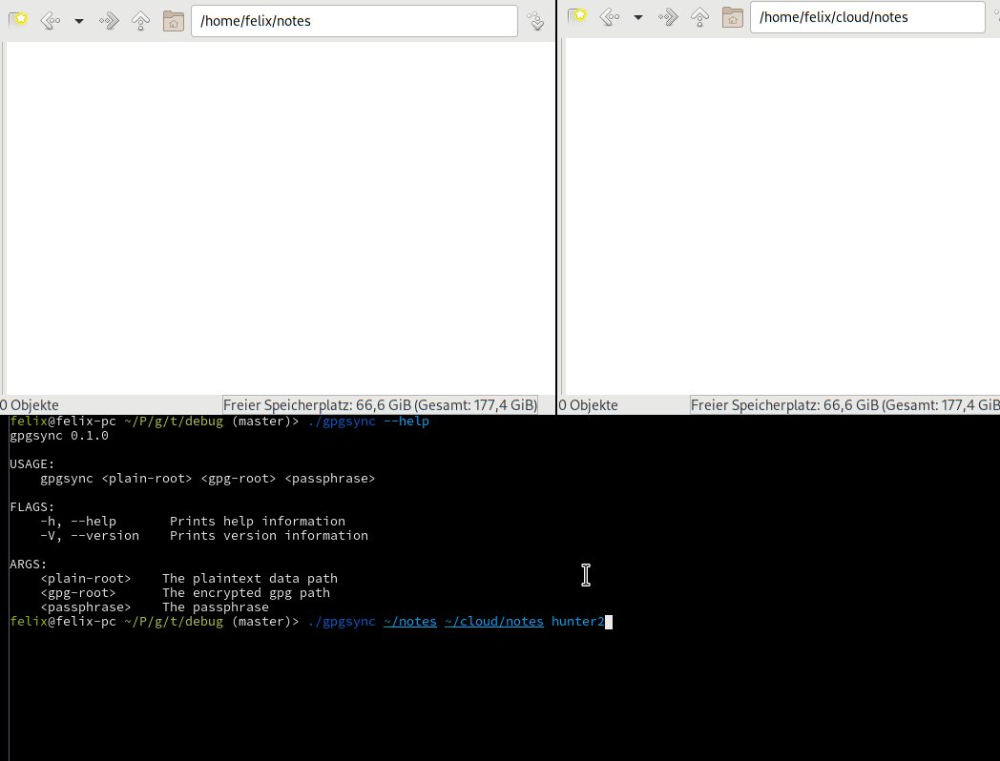

# gpgsync

GPGsync is a command line application that keeps two directories on your computer in sync.  When a file is synced, it is transparently en- or decrypted such that one directory contains all the original files and the other encrypted versions of all the files.

One example where this tool is very useful is when you use a cloud sync service like Dropbox but want to keep the file contents private.  GPGsync wil mirror the directory with your files into the Dropbox directory and make sure that the Dropbox dir contains only encrypted files.  Thus you can sync your diary, [org-roam](https://github.com/org-roam) files, etc. across multiple machines, encrypted in the cloud.

# Features

Current and planned features:

- [X] Bidirectional sync between two directories, one unencrypted, one encrypted.
- [X] Encryption of file contents. File names are not encrypted.
- [X] A single passphrase for all files.
- [X] Continuously watch the directories and sync when files are modified.
- [X] Maintain a database of file metadata to detect file modifications that happened since the program last ran. 
- [X] All hidden files are ignored (= files starting with a '.').
- [X] Ignore `*.gpg` files in the plain dir, ignore non-`*.gpg` files in the gpg dir.
- [ ] Correctly handle renamed files.
- [ ] Respect a .gitignore in the plain directory.
- [ ] Graceful handling of errors, wrong passphrase, and sync conflicts (currently the program just exits).
- [ ] More tests.
- [ ] File locking to try to prevent more file system race conditions.

Non-features:

- A database containing all file revisions is not planned. Init a git repository in your plain dir if you wish to achieve this.

# Caveats

Only use this if you are doing frequent backups of your data!  This project is in an early stage and not yet thoroughly tested!  I take no responsibility if you lose data with this program, even though I try my hardest to make it not do this.

Bidirectional sync is hard.  Several types of conflicts can occur when data changes at both ends at once.  A database containing the last known file metadata is maintained that is used at startup to detect changes that occurred since the last program run.

Writing Files is dangerous.  File locking mechanisms are often non-obligatory.  Thus, if GPGsync syncs a file while the target file is also written to by another program, something will go wrong.  A full database of all past revisions of a file to retroactively restore files to a valid version in such a case is out of scope for this program and *not* planned.

That being said, you should be good to go if
1. you modify files in at most one of the two directories while the program is not running.
2. you modify only either the unencrypted or the encrypted version of the file at any single point in time. 

# Installation and Usage

GPGsync depends on [gpgme](https://www.gnupg.org/software/gpgme/index.html), so make sure the library is installed on your system.  GPGsync will not work if you disabled file modification time on your filesystem.

Currently there are no packaged pre-built binaries available, so you will have to build it from source yourself using `cargo build --release` in the code directory.  You can then copy the binary from `target/release/gpgsync` to a location of your liking.

To run, just use `gpgsync path/to/plain_dir path/to/encrypted_dir passphrase`.
